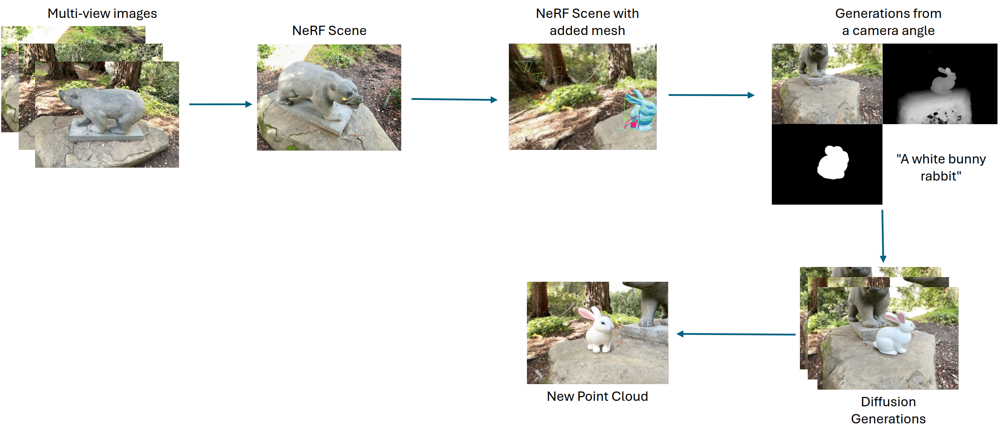

# Object Insertion

To perform object insertion in this project, we first create a mesh of the removed object using [instant-nsr-pl](https://github.com/bennyguo/instant-nsr-pl), and then realistically integrate the object into the scene using [SIGNeRF](https://github.com/cgtuebingen/SIGNeRF). To setup each project, please follow the setup instructions in the respective repositories.
