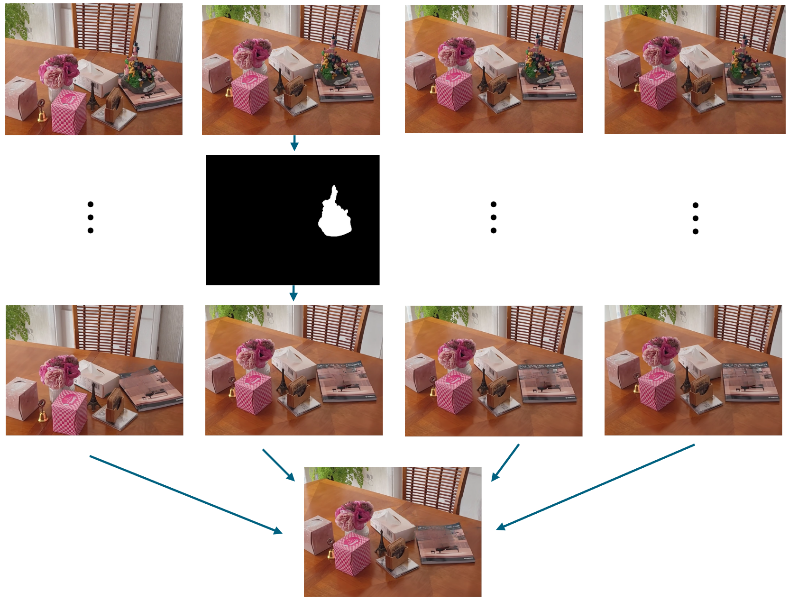

# Object Removal

There are various different methods to achieve object removal from a 3D scene. In this project we choose to combine 3D reconstruction with 2D image inpainting. 3D reconstruction allows a 3D point cloud to be constructed from a series of images of the scene from different angles. By first performing inpainting on each image (removing the object from each image), and then performing reconstruction using the inpainted images, a 3D scene with the object removed is created.

## Removal via Inpainting

