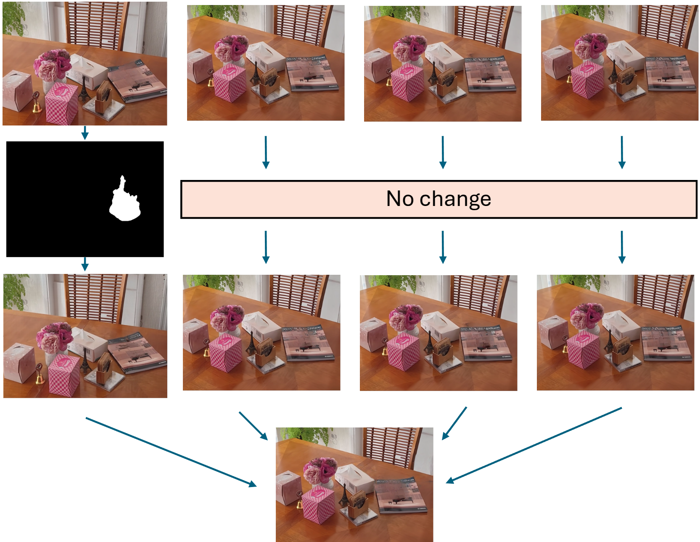

# Object Removal

There are various different methods to achieve object removal from a 3D scene. In this project we choose to combine 3D reconstruction with 2D image inpainting. 3D reconstruction allows a 3D point cloud to be constructed from a series of images of the scene from different angles. By first performing inpainting on each image (removing the object from each image), and then performing reconstruction using the inpainted images, a 3D scene with the object removed is created.

## Removal via Inpainting

Inpainting can be done with [lama](https://github.com/advimman/lama), however, I have found that individual inpainting frames in the multi-view image sequence can sometimes yield inrealistic results. The below illustration shows how FLUX inpainting can be used to reperform inpainting on these individual frames. FLUX sometimes creates a new object rather than inpainting the region underneath the removed object, and hence it cannot be reliably used in the automated process of inpainting every frame. However, it can be a useful tool to fix frames processed by lama. FLUX can be run with the following [script](./flux_inpainting.py).

