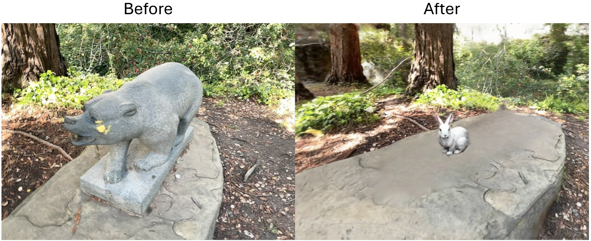
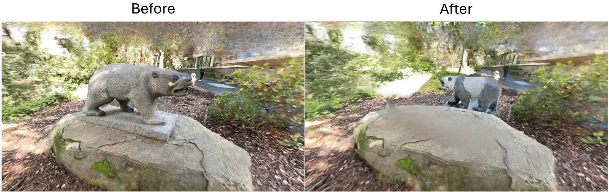
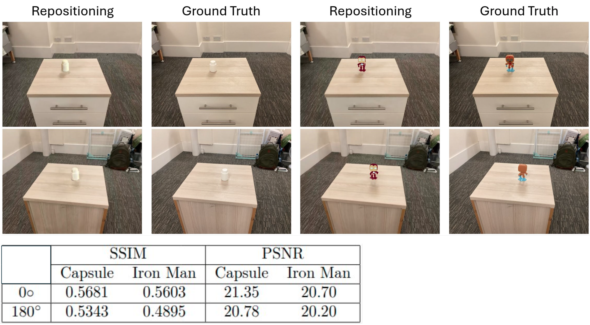

# Editing_3D_Scenes
This repository contains work I produced for my Master's thesis at Imperial, titled "Moving Objects in 3D Point Clouds". 

Currently, there exists no 3D editing tool that allows user-controlled relocation of objects
within a 3D point cloud to new positions. This report introduces a pipeline that allows object
repositioning in 3D point clouds by first removing the object from its current location, inpainting
the region exposed by the removed object, and then inserting the removed object at a new location
in the point cloud. Furthermore, the pipeline supports the operations of only removing the object,
or replacing the removed object with a different object. To set up evaluation metrics for these
operations, a testing procedure is also developed which allows the quality of object repositioning,
object removal and object replacement to be compared to a ground-truth measure.

## Results

While the object is moved or replaced in the 3D point cloud, here are some 2D renders of the generated point cloud using the pipeline:

### Replacement

### Repositioning

## Evaluation

